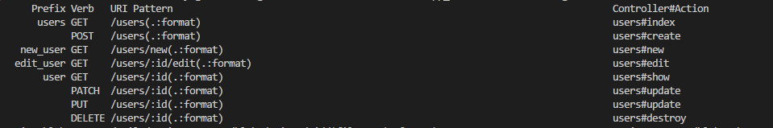
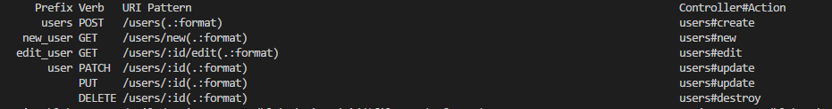
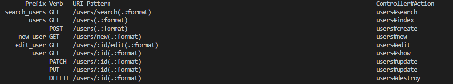
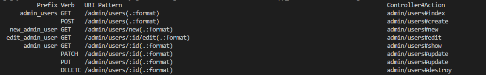
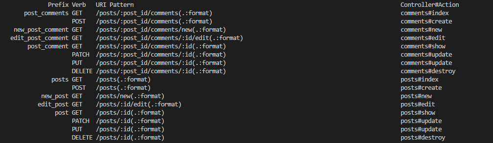

# W5 - D4 - Rails Route + Controller Exercise

## Resource

> Resource dùng để khai báo tất cả các routes cho một controller thay vì phải khai báo các routes riêng biệt trên từng dòng.

#### Routes.rb

``` ruby
	Rails.application.routes.draw do
	  resources :users
	end
```

#### Rails routes

 

### Except, Only

``` ruby
Rails.application.routes.draw do
  resources :users, except: [:index, :show] # only: [...]
end
```

#### Rails routes



> resources sẽ tạo ra các routes cho controller ngoại trừ các routes dẫn tới các def controller có trong mảng except, only thì ngược lại với except sẽ tạo ra các routes có trong mảng only.

### Collection

#### Routes.rb

``` ruby
Rails.application.routes.draw do
  resources :users do
    collection do
      get 'search'
    end
  end
end
```

> Colelction sẽ route tới hành động search trong UsersController và tạo ra  search_users_url và search_users_path.

#### Rails routes



> /users/search không còn id user. Để có thể truy xuất đến ta dùng query /users/search?id=1 


### Namespace

> Namespace dùng để nhóm các routes của các controller nằm trong một thư mục.

#### Routes.rb

``` ruby
Rails.application.routes.draw do
  namespace :admin do
    resources :users
  end
end
```

#### Rails routes



### Nested

> Nested để tạo các routes lồng nhau

#### Rails.rb

``` ruby
Rails.application.routes.draw do
	resources :posts do
		resources :comments
	end
end
```

#### Rails routes



## Callbacks

> Callback là các phương thức được gọi tới vào một thời điểm nào đó trong vòng đời của một đối tượng. Callback thường được dùng để thực thi các phương thức logic trước hoặc sau khi đối tượng được created, updated, saved, deleted, validated hoặc load từ cơ sở dữ liệu. Bởi vì là một phương thức nên callback cần được khai báo trong model trước khi sử dụng

``` ruby
before_save { email.downcase! } # Sẽ set email về chữ thường trước khi được lưu
```

Trong trường hợp ta có 1 before_action dùng chung cho tất cả. Nhưng tại lớp hiện tại ta muốn bỏ qua việc thực thi before_action đó ta dùng skip_before_action

``` ruby
skip_before_action :require_login # Bỏ qua yêu cầu đăng nhập
```

## Strong params

> StrongParameters là 1 phương pháp để đối phó với lỗi bảo mật khi sử dụng tính năng Mass Assignment.

> Mass Assignment là 1 tính năng cực kì tiện lợi cho phép update 1 model – khi tạo mới hoặc thay đổi – bằng hash của Ruby.

``` ruby
# Mass Assignment
# params = {name: "Quang Dũng", email: "dung.nguyen3@asiantech.vn"}
 def update
    user = User.first
    user.update(params[:user])
 end
```

Nếu truyền thêm các params không mong muốn như password thì hàm update sẽ thay đổi password của user vì thế ta sử dụng strong params để khắc phục

``` ruby
 def update
    user = User.first
    user.update(params[:user])
 end

private

 def user_params
   params.require(:user).permit(:name, :email)
 end
```

* require(:user) bắt buộc trong params phải có key là user
* permit(:name, :email) trong key user chỉ cho phép name và email

## Flash

> Flash là 1 phương pháp hiển thị thông báo khi chạy các action

``` ruby
flash[:success] = "Success"
```

Khi action redirect_to thì trang sẽ hiển thị thông báo "Success". Ngoài ra, để hiện thị flash message khi render ta dùng:

``` ruby
flash.now[:success] = "Success"
```

## Transaction

``` ruby
ActiveRecord::Base.transaction do
  User.create(name: 'Dũng' email: 'dung.nguyen3@asiantech.vn')
  User.last.update!(gender: 0)
end
```

Transaction giúp toàn vẹn dữ liệu, nếu hàm update xảy ra lỗi thì sẽ rollback tất cả lệnh trong block transaction, User vừa tạo cũng sẽ bị rollback.

## Render vs Redirect_to

> Có 2 cách hiển thị dữ liệu là render và redirect_to
> Phân biệt render và redirect_to

``` ruby
def update
  @product= Product.find(params[:id])
   if @product.update_attributes(params[:name])
     redirect_to :action => 'index'
   else
     render :edit
   end
end
```

Nếu update thành công sẽ chuyển hướng đên trang index, nếu không thì sẽ render tới trang edit. Khi dùng render tới edit, rails sẽ giữ lại các params đã sent để người cùng có thể chỉnh sửa. Nếu dùng redirect_to, rails sẽ tạo ra một request mới, không còn các params cũ.

Các def trong controller, thường sẽ render mặc định đến view cùng tên.

